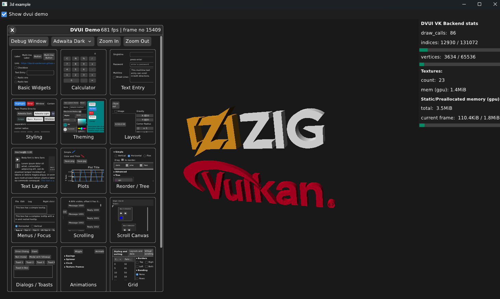

# Vulkan Backend for dvui 
[](https://github.com/Deins/dvui_vk/actions/workflows/build.yml)

This project provides a vulkan backend for [dvui](https://github.com/david-vanderson/dvui).  
Targeting `vulkan 1.2` an newer and `zig v0.15.2` (see tags for older ver)



### Current platform support

* **Windows** native
* Using GLFW library. Build with flag `-Dglfw`.  
Standalone example not implemented at the moment. 
    * **Windows** GLFW
    * **Linux** GLFW 

Backend is separated in parts:
* [dvui_vk_renderer.zig](./src/dvui_vk_renderer.zig) - implements platform independent renderer, suitable for already existing vulkan apps or apps that want to do their own windowing, input etc. Only dependency: [vulkan_zig](https://github.com/Snektron/vulkan-zig)
* DVUI backend implementations, has additional dependencies (see build.zig.zon):
    * [dvui_vk_win32.zig](./src/dvui_vk_win32.zig) - backend based on native win32 api for windowing and input. (Windows only)
    * [dvui_vk_glfw.zig](./src/dvui_vk_glfw.zig) - backend based on glfw for windowing and input. Use `-Dglfw` build flag to enable.
    * [dvui_vk_common.zig](./src/dvui_vk_common.zig) - additional common stuff used by all backends.

### todo, known issues
* Rendering:
    * textureRead() not implemented
    * option to pass in general purpose gpu memory allocator for textures
    * linear color space frame-buffers. (easily switchable with source modifications, but tricky to expose).
* App/Platform functionality:
    * should try to get free-type running for dvui text rendering instead of default stb-truetype. As text rendering quality is not as good. 
    * Touch events
    * for windows native backend:
        * Sleep when inactive is not implemented.
        * Some misc platform functions such as openURL, clipboard etc.
    * When using `sleep when inactive` we can get occasional `Swapchain image was presented but was not re-acquired` validation error. Cant be caught when rendering at full frame rate.
    * max frames in flight must match swapchain image count, otherwise can get validation errors. Safe value is 3. In future max frames in flight should be completely decoupled from swapchain image count.

## Build & Run
```sh
zig build run-app -Doptimize=ReleaseFast -Dglfw
```
Vulkan SDK is optional but recommended for development (to be able to run vulkan validation layers etc). To use vulkan sdk make sure `VULKAN_SDK` environment variable is correctly defined. 

Shaders when modified need be recompiled by adding `-Dslangc` to build command. ([slangc](https://github.com/shader-slang/slang/releases) comes packaged with vulkan SDK or needs to be installed separately).

### Standalone with vulkan 3D rendering
`zig build run --build-file ./examples/3d/build.zig -Dglfw`  
Or alternatively `cd examples/3d` and `zig build run -Dglfw`

### Standalone example
Similarly as others only `run` instead of `run-app`. And skip `-Dglfw` - windows native only.